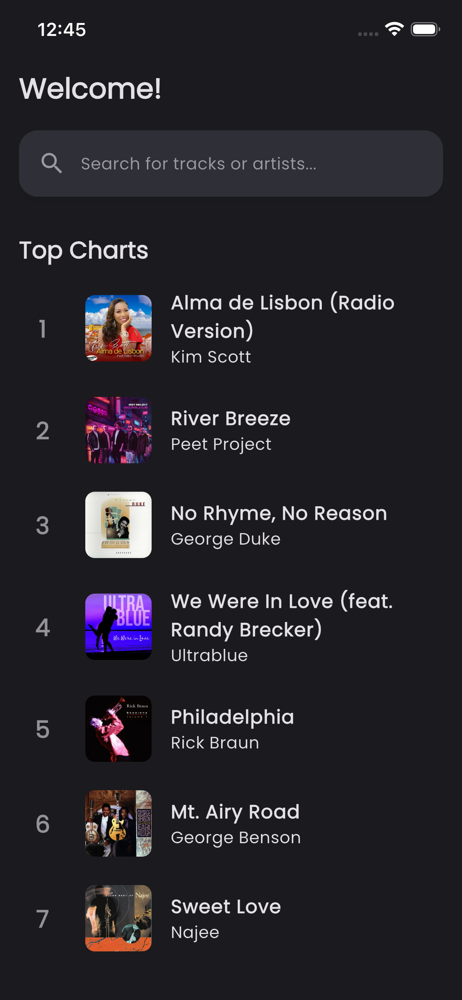
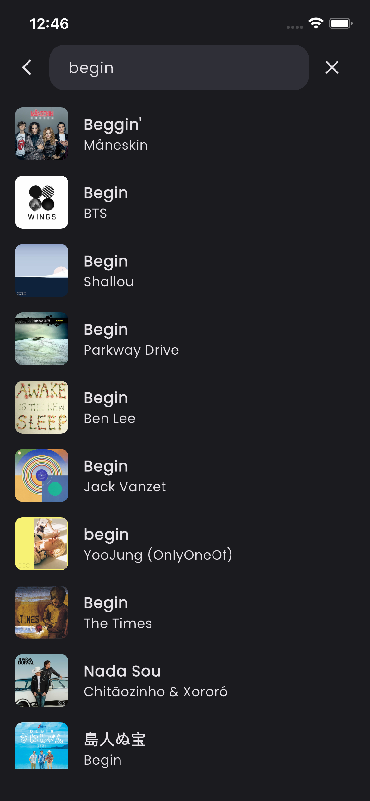
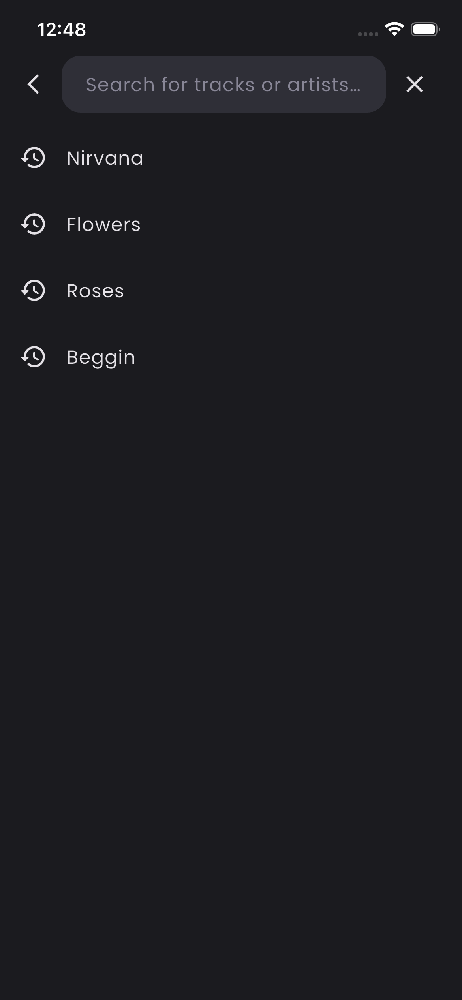
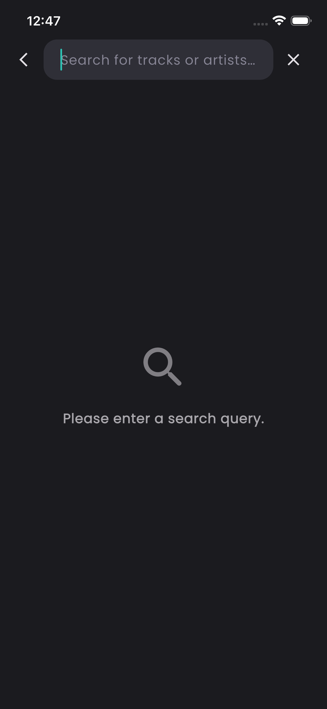
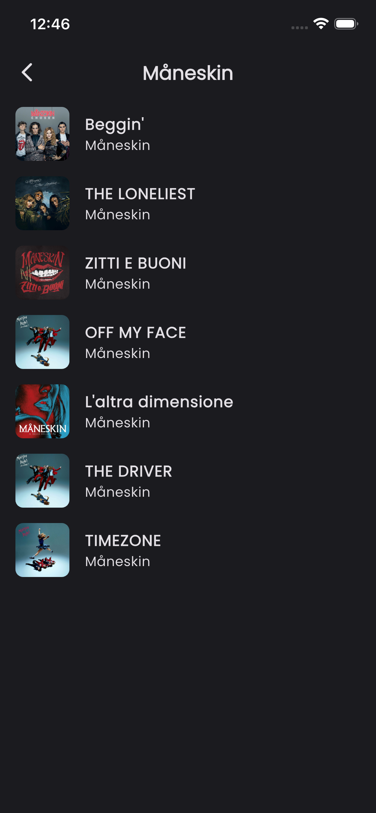
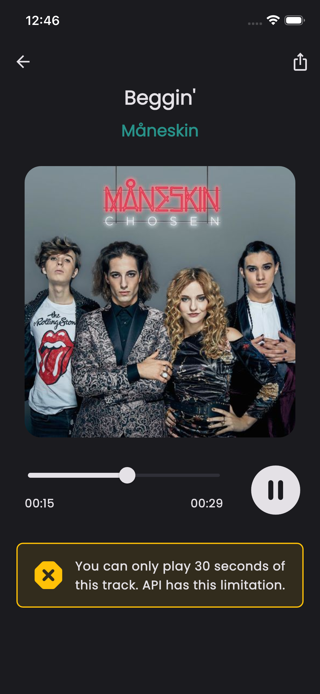

### Listen To My Tracks

An example Flutter application for a hiring test. The app lets users search for music tracks and artists, view track details, and quickly play short previews. It demonstrates a Clean Architecture approach, feature-first UI structure, offline-friendly UX for search history, and modern Flutter tooling.

---

## Features
- **Home**: Entry point with navigation to search and recent activity
- **Search**: Search for tracks/artists with debounced queries
- **Search history**: Persisted locally with quick re-run and clear actions
- **Track details**: Metadata, share action, and preview playback
- **Artist tracks**: Browse popular tracks for a selected artist
- **Connectivity-aware**: Basic handling of offline state

## Tech Stack
- **Flutter** with Material 3
- **Dart SDK**: ^3.9.2 (see `pubspec.yaml`)
- **State management**: `flutter_bloc`
- **Routing**: `auto_route`
- **DI / Service Locator**: `get_it`
- **Networking**: `dio`
- **Audio preview**: `just_audio`
- **Local storage**: `sqflite`, `path`
- **Utilities**: `equatable`, `connectivity_plus`, `share_plus`, `google_fonts`
- **Codegen/Tooling**: `build_runner`, `auto_route_generator`, `json_serializable`, `flutter_lints`

## Architecture
The project follows a layered, testable design inspired by Clean Architecture:
- `lib/domain/`: Entities, repository contracts, and domain services
- `lib/data/`: DTO/models, mappers, remote/local data sources, repository implementations
- `lib/features/`: Presentation layer grouped by feature (`home`, `search`, `details`, `artist_tracks`) with BLoCs and widgets
- `lib/app/`: App-level composition (DI, routing, resources)
- `lib/core/`: Shared utilities, widgets, and error handling

This structure keeps business rules independent from the UI, enabling easier testing and maintenance.

## Getting Started
1) Install Flutter and Dart (Dart SDK ^3.9.2 or later compatible with your Flutter channel)
2) Fetch dependencies:

```bash
flutter pub get
```

3) Run code generation (routing, JSON, etc.):

```bash
dart run build_runner build --delete-conflicting-outputs
```

4) Launch the app:

```bash
flutter run
```

To run on a specific device/simulator, use `flutter devices` and pass `-d <deviceId>`.

## Testing
- Unit and widget tests:

```bash
flutter test
```

- Integration test (if configured for your environment):

```bash
flutter test integration_test
```

## Screenshots
Below are sample screens from the app. All images are located in the `screenshots/` directory.

<table>
  <tr>
    <td></td>
    <td></td>
  </tr>
  <tr>
    <td></td>
    <td></td>
  </tr>
  <tr>
    <td></td>
    <td></td>
  </tr>
  
</table>

## Project Scripts and Tips
- Rebuild generated files when routes/models change:

```bash
dart run build_runner build --delete-conflicting-outputs
```

- If you change launch icons, update `flutter_launcher_icons` config in `pubspec.yaml` and run:

```bash
dart run flutter_launcher_icons
```

## Folder Overview
- `lib/app/` – DI (`service_locator.dart`), routes, resources
- `lib/core/` – errors, shared utils, shared widgets
- `lib/domain/` – entities, repository interfaces, domain services
- `lib/data/` – datasources, mappers, models, repository implementations
- `lib/features/` – presentation by feature: `home`, `search`, `details`, `artist_tracks`
- `assets/` – images and other static assets (declared in `pubspec.yaml`)
- `screenshots/` – app screenshots used in this README

## Notes
- Network APIs, models, and sample responses are wired via `dio` and mappers. Replace or point the data layer to your desired backend as needed.
- Audio previews are short samples; device simulators might require additional configuration for audio output.